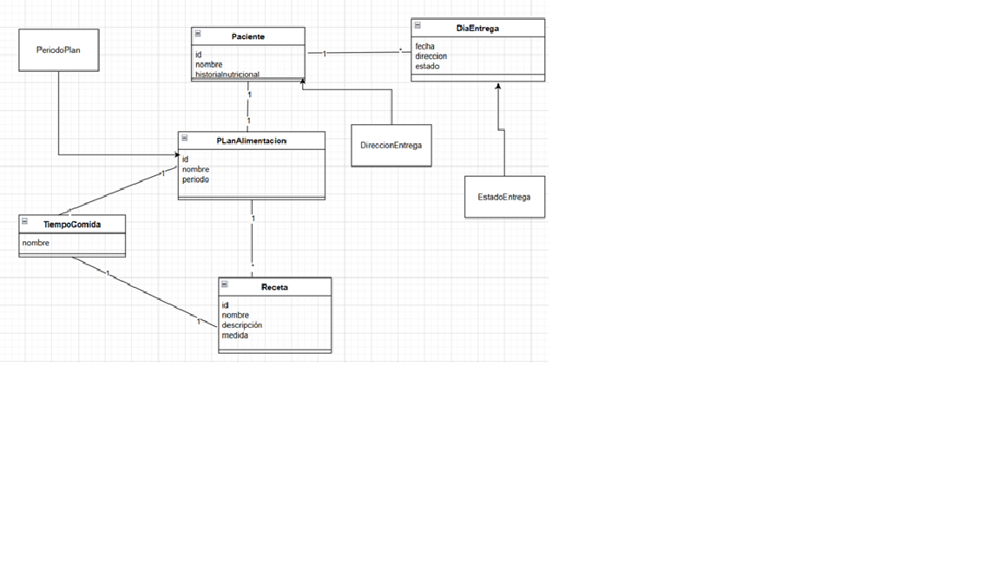

# PlanesAlimentacion API

## Descripción del Microservicio

El microservicio `PlanesAlimentacion` gestiona planes alimentarios personalizados. Su propósito es permitir la creación, consulta y gestión de planes de alimentación que incluyen tiempos de comida y recetas específicas para cada tiempo.

Este microservicio forma parte de una arquitectura basada en **DDD (Domain-Driven Design)** y **Clean Architecture**, separando claramente las responsabilidades en capas de dominio, aplicación, infraestructura y presentación.

### Funcionalidades principales

- **Registrar un nuevo plan de alimentación** con duración en días, tiempos de comida y recetas asignadas.
- **Asignar recetas** a cada tiempo de comida dentro de un plan.
- **Consultar los planes registrados** con sus tiempos y recetas asociadas.

---

## Diagrama de Clases de la Capa de Dominio

El siguiente diagrama representa las entidades del dominio del microservicio:
## Diagrama de Clases

[Ver documentación técnica del microservicio](./Documentación%20Técnica_Melgar_Zabala_Paul.docx)

### Entidades

- **PlanAlimentacion**
  - `Id: Guid`
  - `DuracionDias: int`
  - `TiemposComida: List<TiempoComida>`
  - `+AgregarTiempoComida(TiempoComida tiempo)`

- **TiempoComida**
  - `Id: Guid`
  - `Nombre: string`
  - `Recetas: List<Receta>`
  - `+AsignarReceta(Receta receta)`

- **Receta**
  - `Id: Guid`
  - `Nombre: string`

### 🔌 Interfaz de Repositorio

- **IPlanRepository**
  - `+GuardarAsync(PlanAlimentacion plan)`
  - `+ObtenerTodosAsync(): List<PlanAlimentacion>`

## Estructura del Dominio

### Agregados
- PlanAlimentacion
- Paciente

### Entidades
- TiempoComida
- Receta
- DiaEntrega

### Value Objects
- DireccionEntrega
- EstadoEntrega
- PeriodoPlan

## Requisitos Técnicos
- .NET 8.0
- Visual Studio 2022 o superior
